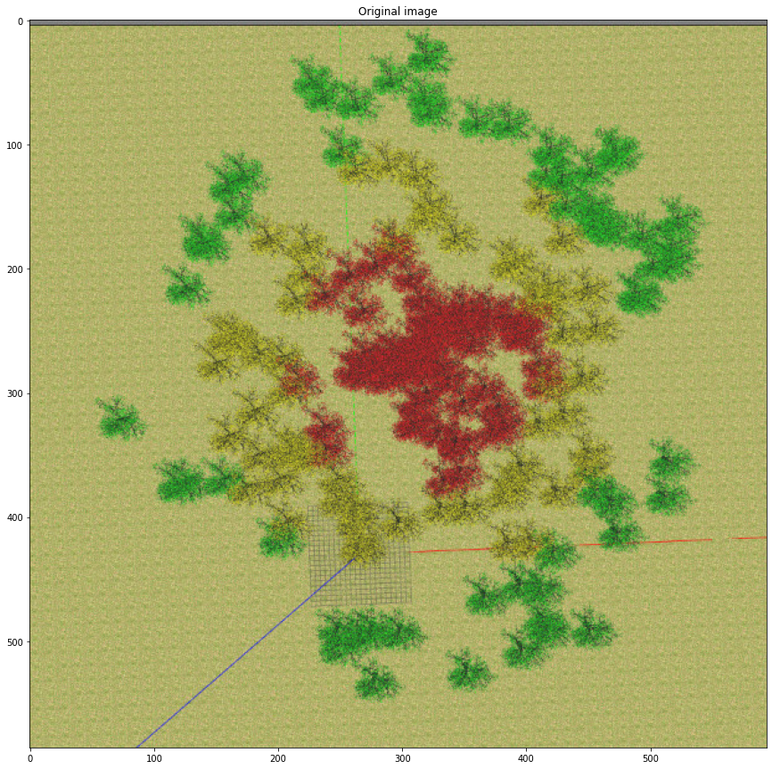

# NoFire Squad - SARC 2022

## Introduction

In the modern world, working with a swarm of drones is gaining increasing prominence in research and  academic work due to its great potential for applicability. However, even though it is becoming more  common, it still presents a high level of complexity due to the challenges of controlling and coordinating  the movements of several UAVs at once. This project aims to use the swarm aproach to create a solution to a forest fight scenario developed by SARC (*Swedish Aerospace Research Center*), which will be simulated using the Gazebo environment and ROS services.

<p align="center">
  
</p>

## How it works

The NoFire Squad works with the use of a swarm of 9 independent uavs that communicate with a central node, which performs all the definitions of positions and trajectories for each of the drones. In addition, one of these drones, determined as the central drone, acts only in the supervision and dimensional definition of the area affected by the fire, while the other aircraft are responsible for direct firefighting. In addition, the logic addressed for fighting the fire was to use a state machine for the swarm, in order to differentiate the decisions made according to the current state.

<p align="center">
  
</p>

Using the state machine, the approach to fire fighting was done through the steps of patrol, center, combat and return to base.

### Patrolling

During the patrolling state, all aircraft, including the central drone, are sent to different quadrants of the region in order to search for the fire source. In each quadrant, the drones will display a Hamiltonian cycle in order to cover their quadrant while looking for the presence of fire in their docked camera. Below is a representation of the patrol trajectory of each aircraft, as well as a representation of the movement of each one within its quadrant.

<p align="center">
  
</p>

<p align="center">
  
</p>

Once an aircraft detects fire on its camera, the swarm is sent into position in a circular formation, featuring the central drone at its center. It is worth mentioning that the detection of all the fire carried out in this simulation is being done in a simplified way of what would be presented in a real application, being carried out from a mask applied to the image received by the camera as shown in the images below.

<p align="center">
  
  
</p>

### Centering Fire


## Getting Started

This github is presented as a ros package, using as a base the package presented by SARC ([github](https://github.com/2nd-sarc-barinet-aerospace-competition/sarc_environment)), in order to allow a single installation of the environment proposed by them and the implementation discussed above.

### Dependencies

- Ubuntu 20.04
- Gazebo 11.10
- ROS Noetic
- MRS System
- NOTE: MRS documentation [https://ctu-mrs.github.io/](https://ctu-mrs.github.io/)

### Installing

-   Installing MRS: at the link [https://github.com/ctu-mrs/mrs_uav_system](https://github.com/ctu-mrs/mrs_uav_system) , go to the Installation section and choose one of the installation options, any of them will work, we recommend that you use the local option, that you just run the script and everything is automatically downloaded.
-   To use this package, simply clone this repository into a Catkin workspace and build. Since you are using the MRS system, simply clone this package into the "mrs_workspace" folder that is in "home".

### Executing simulation

In order to improve the user experience, the Tmux terminal multiplexer was used to start the entire simulation from a single terminal command. Performing the command, multiple terminals are initialized in order to start the ROS environment, open the gazebo environment, spawn the aircraft and start the algorithm presented here.

- In order to run the simulation, go to the folder start and running start.sh, using in the terminal

```
./start.sh
```

## Conclusion

### NoFire Squad Team Members

- Daniel Yukio Miguita: [Github](), [Linkedin]()
- Guilherme Barela de Castro: [Github](), [Linkedin]()
- Guilherme Barros Villela: [Github](), [Linkedin]()
- Lucas Harim Gomes Cavalcanti: [Github](), [Linkedin]()
- Matheus Della Rocca Mastins: [Github](), [Linkedin]()
- Raul Cotrim Ferreira: [Github](), [Linkedin]()
