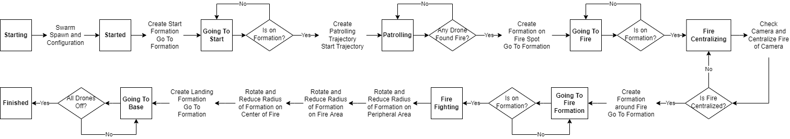
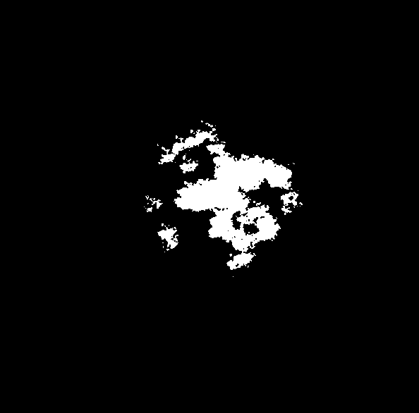

# NoFire Squad - SARC 2022

## Introduction

In the modern world, working with a swarm of drones is gaining increasing prominence in research and  academic work due to its great potential for applicability. However, even though it is becoming more  common, it still presents a high level of complexity due to the challenges of controlling and coordinating  the movements of several UAVs at once. This project aims to use the swarm aproach to create a solution to a forest fight scenario developed by SARC (*Swedish Aerospace Research Center*) in its competition 2nd Sarc-barinet Aerospace-Competition ([edital](https://sarc.center/2nd-sarc-barinet-aerospace-competition/)), which will be simulated using the Gazebo environment and ROS services.

<p align="center">
  
</p>

## Simulation Video

In order to enable the visualization of the project without the need to compile the code developed here, a YouTube video showing a recording of the simulation performed is shown below. It is worth mentioning that the simulation time differs from the real time, since there are delays due to the computation of the environment. In this way, the video is accelerated in order to present the real time as the simulated time (6:40 minutes).

[](https://www.youtube.com/watch?v=N1TAa1z4Fp0)

<p align="center">
  <a href="https://www.youtube.com/watch?v=N1TAa1z4Fp0" title="Link Title">
	  
  </a>
</p>

## How it works

The NoFire Squad works with the use of a swarm of 9 independent uavs that communicate with a central node, which performs all the definitions of positions and trajectories for each of the drones. In addition, one of these drones, determined as the central drone, acts only in the supervision and dimensional definition of the area affected by the fire, while the other aircraft are responsible for direct firefighting. In addition, the logic addressed for fighting the fire was to use a state machine for the swarm, in order to differentiate the decisions made according to the current state.

<p align="center">
  
</p>

Using the state machine, the approach to fire fighting was done through the steps of patrol, center, combat and return to base.

### Patrolling

During the patrolling state, all aircraft, including the central drone, are sent to different quadrants of the region in order to search for the fire source. In each quadrant, the drones will display a Hamiltonian cycle in order to cover their quadrant while looking for the presence of fire in their docked camera. Below is a representation of the patrol trajectory of each aircraft, as well as a representation of the movement of each one within its quadrant.

<p align="center">
  
</p>
	
<p align="center">
  
</p>

Once an aircraft detects fire on its camera, the swarm is sent into position in a circular formation, featuring the central drone at its center. It is worth mentioning that the detection of all the fire carried out in this simulation is being done in a simplified way of what would be presented in a real application, being carried out from a mask applied to the image received by the camera as shown in the images below.

<p align="center">
  
  
</p>

### Centering Fire

During fire centering, the real drone is responsible for constantly viewing the fire on its camera while estimating the three-dimensional position of the center of the region shown on the mask in order to move to the determined position. Also, when the area is centered in the camera but it is not possible to verify a contour without fire, the aircraft will go to a higher altitude, in order to visualize a larger area. This process continues until the entire fire area is visualized and centered on the camera, confirming the centering of the region by the aircraft. In the image below, 

The image below shows the simulation moment in which the fire is centered. It is possible to check the fully visible and centralized fire region in the mask shown on the right.

<p align="center">
  
</p>

### Fire Combat

After the centralization of fire, the other 8 aircraft are sent to a circular formation around the area visualized by the central drone in order to start combat. In order to contain the spread of fire, the formation starts combat in the outer region while moving towards the center in a rotational way in an attempt to cover a greater area. This rotational movement can be visualized below.

<p align="center">
  
</p>

### Return to Base

Once the firefight is over, all aircraft are directed to the predetermined landing region. In order to maintain organization, aircraft move in a circular formation and land in the same formation. In the images below it is possible to verify the joint movement of the drones together with the joint landing.

<p align="center">
  
</p>

<p align="center">
  
</p>

## Getting Started

This github is presented as a ros package, using as a base the package presented by SARC ([github](https://github.com/2nd-sarc-barinet-aerospace-competition/sarc_environment)), in order to allow a single installation of the environment proposed by them and the implementation discussed above.

### Dependencies

- Ubuntu 20.04
- Gazebo 11.10
- ROS Noetic
- MRS System
- NOTE: MRS documentation [https://ctu-mrs.github.io/](https://ctu-mrs.github.io/)

### Installing

-   Installing MRS: at the link [https://github.com/ctu-mrs/mrs_uav_system](https://github.com/ctu-mrs/mrs_uav_system) , go to the Installation section and choose one of the installation options, any of them will work, we recommend that you use the local option, that you just run the script and everything is automatically downloaded.
-   To use this package, simply clone this repository into a Catkin workspace and build. Since you are using the MRS system, simply clone this package into the "mrs_workspace" folder that is in "home".

### Executing

#### Configurations

In order to carry out the simulation without errors, a configuration must be carried out within the MRS system. Once we use a camera within a simulated environment, an important parameter for the optimization of the implementation is the presence of a maximum detection distance, since, unlike reality, a simulation cannot simulate light rays reaching the sensors of the camera. In this way, since the central drone can reach an altitude greater than 100m, the centralization of the fire area would be impossible due to the maximum distance of 100m for camera detection. Thus, it is necessary to increase this maximum distance, in order to allow the camera to be read in the final steps of fire centering.

To make this change, it is necessary to change line 1855 in the *component_snippets.xacro* file. This file is found in the path "~/mrs_workspace/src/simulation/ros_packages/mrs_simulation/models/mrs_robots_description/urdf". This change must be made as shown below.

- Before

```html
<far>100</far>
```

- After

```html
<far>150</far>
```

#### Running the simulation

In order to improve the user experience, the Tmux terminal multiplexer was used to start the entire simulation from a single terminal command. Performing the command, multiple terminals are initialized in order to start the ROS environment, open the gazebo environment, spawn the aircraft and start the algorithm presented here.

- In order to run the simulation, go to the folder start and running start.sh, using in the terminal

```
./start.sh
```

## Conclusion

In the last 2 months our group has developed great knowledge about the drone swarm and firefighting concept, in addition to all other topics such as computer vision, control, mechanics and electronics. From this knowledge it was possible to create the NoFire Squad project in an attempt to carry out the fire fighting presented by the SARC in the most efficient way using a swarm. 

For our group, the development presented here demonstrates a very satisfactory result for our student development. We believe that there are still points for improvement such as the use of more sensors, a more robust patrol or a more intense fire fighting with a greater number of drones, but we believe that what has been presented here proves to be even better than expected due to complexity of the problem. 

Finally, we would like to thank SARC for the opportunity to participate in this competition and for all the support we have had throughout these months.

### NoFire Squad Team Members

- Daniel Yukio Miguita: [Github](https://github.com/miguita), [Linkedin](http://www.linkedin.com/in/daniel-miguita)
- Guilherme Barela de Castro: [Github](https://github.com/guilherminhobc), [Linkedin](https://www.linkedin.com/in/guilherme-barela-de-castro-57707720b/)
- Guilherme Barros Villela: [Github](https://github.com/Villela-G), [Linkedin](https://www.linkedin.com/in/guilherme-villela)
- Lucas Harim Gomes Cavalcanti: [Github](https://github.com/LucasHarim), [Linkedin](https://www.linkedin.com/in/lucas-harim/)
- Matheus Della Rocca Mastins: [Github](https://github.com/MatheusDrm), [Linkedin](https://www.linkedin.com/in/matheus-martins-9aba09212/)
- Raul Cotrim Ferreira: [Github](https://github.com/raul00cf), [Linkedin](https://www.linkedin.com/in/raul-cotrim-a86420163/)
